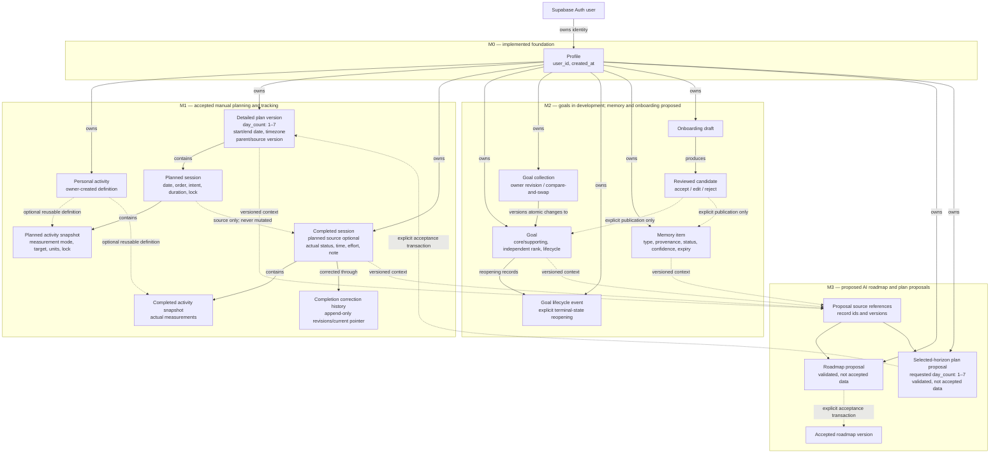

# FitTip data-model overview

**Status:** legacy pre-reset view — F-005 and ADR-016 supersede its bounded
plan/completion destination; retained to describe the runtime removed by M3-11

This diagram shows the accepted legacy ownership and history boundaries that
existed before the rolling-plan reset. The replacement conceptual model lives
in [F-005](F-005-ROLLING-TRAINING-PLAN.md); exact implementation remains gated
by M3-10 through M3-17.

## How to read it

- **M0 is actual:** the public data model starts with an owner profile backed
  by Supabase Auth.
- **M1 is accepted legacy history:** a detailed plan version contains exactly
  the user-requested 1–7 consecutive owner-local dates. M3-11 deletes its
  runtime training records rather than converting them.
- **M2-01 is accepted:** it adds owner-scoped goal,
  collection-revision, and minimal lifecycle-event records. One authenticated
  transaction owns all changes; active core and supporting ranks are separate.
- Planned sessions/activities and completed sessions/activities are separate.
  The dotted source link never converts or rewrites a plan into an actual.
- Personal activity definitions are reusable, but every historical plan and
  completion retains its own immutable snapshot.
- Goals and memory enter planning context only after accepted M2 behavior.
- AI outputs are proposals. Before the reset, accepted M3-02/M3-03 records use
  the legacy boundaries shown here. After M3-16, only its explicit **Finish
  review** may add selected suggestions to the rolling Plan.
- Every owned persisted record has an explicit `user_id`; relationships,
  server authorization, and RLS also enforce same-owner access.

## Milestone ownership

| Model area | Owning ticket | Current status |
|---|---|---|
| Profile and ownership baseline | M0-02 / M0-02-C1 | accepted |
| Detailed plans, planned/actual separation, personal activities | [M1-01](../backlog/M1/M1-01-TRAINING-RECORDS-FOUNDATION.md) | accepted |
| Manual selected-horizon plan behavior | [M1-02](../backlog/M1/M1-02-SELECTABLE-HORIZON-PLANNING.md) | accepted |
| Factual logging and correction history | [M1-03](../backlog/M1/M1-03-QUICK-TRAINING-LOGGING.md) | accepted |
| Goals | [M2-01](../backlog/M2/M2-01-GOAL-MODEL-VALIDATION.md) | accepted |
| Memory | [M2-02](../backlog/M2/M2-02-MEMORY-MODEL-MANAGEMENT.md) | proposed |
| Guided-onboarding candidates and explicit publication | [M2-03](../backlog/M2/M2-03-INTAKE-FACT-REVIEW.md) | proposed |
| AI boundary, roadmap, and legacy selected-horizon proposals | [M3-01](../backlog/M3/M3-01-LOCAL-AI-ADAPTER-CONTROLS.md), [M3-02](../backlog/M3/M3-02-ROADMAP-PROPOSAL.md), [M3-03](../backlog/M3/M3-03-SELECTED-HORIZON-PLAN-PROPOSAL.md) | accepted |
| Rolling Plan current state and atomic history | [M3-10](../backlog/M3/M3-10-ROLLING-PLAN-FOUNDATION.md) | accepted |
| Legacy training reset | [M3-11](../backlog/M3/M3-11-LEGACY-TRAINING-RESET.md) | proposed |
| Manual Plan, saved sessions, and recurrence | [M3-12](../backlog/M3/M3-12-MANUAL-CONTINUOUS-PLANNING.md), [M3-13](../backlog/M3/M3-13-PRIVATE-SAVED-SESSION-LIBRARY.md), [M3-14](../backlog/M3/M3-14-RECURRING-SESSION-SERIES.md) | proposed |
| Replacement completions and consumer context | [M3-15](../backlog/M3/M3-15-REPLACEMENT-CONSUMER-READINESS.md) | proposed |
| AI proposal application and regeneration | [M3-16](../backlog/M3/M3-16-AI-PROPOSAL-APPLICATION.md), [M3-03B](../backlog/M3/M3-03B-PLAN-REGENERATION.md) | proposed |
| Final rolling-plan closeout | [M3-17](../backlog/M3/M3-17-FINAL-ROLLING-PLAN-CLOSEOUT.md) | proposed |

## Approval boundary

The visual records the current intended shape. M2-01's exact accepted contract
is governed by its approved ticket, ADR-009, migration, and validation record,
which also documents that acceptance initially waived the independent
exact-commit re-review and that the product owner withdrew that waiver on
30 July 2026, so the review is required before M2-01 is accepted again. M2-02 and M2-03 must still approve their exact tables, fields,
ownership/RLS policies, history, expiry, and publication transactions before
migrations are implemented.
