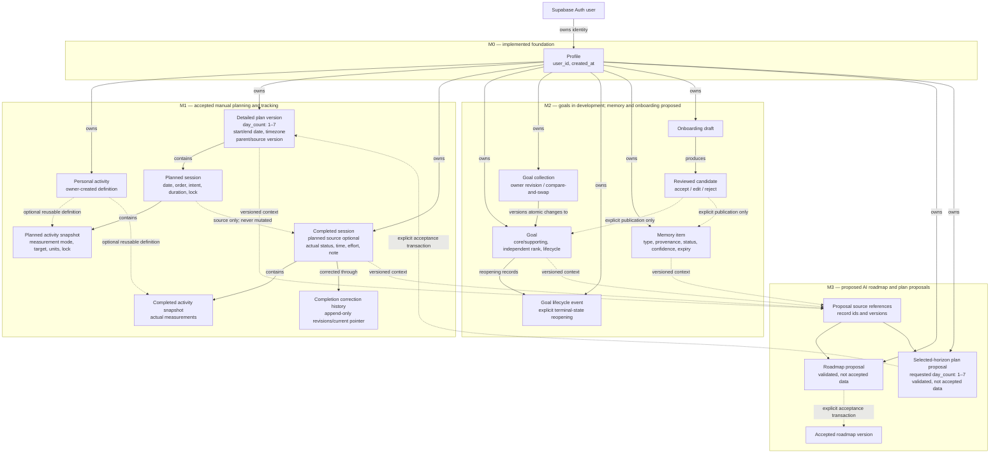

# FitTip data-model overview

**Status:** living planning view — M0 and M1 are accepted; M2-01 is testable
and not yet accepted; later M2 and M3 records remain proposed

This diagram shows the intended ownership and history boundaries. It is a
conceptual overview, not approval of exact table names, columns, migrations, or
transaction mechanisms.

## How to read it

- **M0 is actual:** the public data model starts with an owner profile backed
  by Supabase Auth.
- **M1 is accepted:** a detailed plan version contains exactly
  the user-requested 1–7 consecutive owner-local dates.
- **M2-01 is testable, not accepted:** the ticket branch adds owner-scoped goal,
  collection-revision, and minimal lifecycle-event records. One authenticated
  transaction owns all changes; active core and supporting ranks are separate.
- Planned sessions/activities and completed sessions/activities are separate.
  The dotted source link never converts or rewrites a plan into an actual.
- Personal activity definitions are reusable, but every historical plan and
  completion retains its own immutable snapshot.
- Goals and memory enter planning context only after accepted M2 behavior.
- AI outputs are proposals. Only an explicit reviewed acceptance transaction
  can create an accepted roadmap or detailed plan version.
- Every owned persisted record has an explicit `user_id`; relationships,
  server authorization, and RLS also enforce same-owner access.

## Milestone ownership

| Model area | Owning ticket | Current status |
|---|---|---|
| Profile and ownership baseline | M0-02 / M0-02-C1 | accepted |
| Detailed plans, planned/actual separation, personal activities | [M1-01](../backlog/M1/M1-01-TRAINING-RECORDS-FOUNDATION.md) | accepted |
| Manual selected-horizon plan behavior | [M1-02](../backlog/M1/M1-02-SELECTABLE-HORIZON-PLANNING.md) | accepted |
| Factual logging and correction history | [M1-03](../backlog/M1/M1-03-QUICK-TRAINING-LOGGING.md) | accepted |
| Goals | [M2-01](../backlog/M2/M2-01-GOAL-MODEL-VALIDATION.md) | testable |
| Memory | [M2-02](../backlog/M2/M2-02-MEMORY-MODEL-MANAGEMENT.md) | proposed |
| Guided-onboarding candidates and explicit publication | [M2-03](../backlog/M2/M2-03-INTAKE-FACT-REVIEW.md) | proposed |
| AI proposal/source records | [M3-01](../backlog/M3/M3-01-LOCAL-AI-ADAPTER-CONTROLS.md), [M3-02](../backlog/M3/M3-02-ROADMAP-PROPOSAL.md), [M3-03](../backlog/M3/M3-03-SELECTED-HORIZON-PLAN-PROPOSAL.md) | proposed |
| Proposal edit and explicit acceptance | [M3-04](../backlog/M3/M3-04-PLAN-EDIT-LOCK-ACCEPTANCE.md) | proposed |

## Approval boundary

The visual records the current intended shape. M2-01's exact testable
contract is governed by its approved ticket, ADR-009, migration, and validation
record; it is not accepted until exact-commit review and product-owner
acceptance. M2-02 and M2-03 must still approve their exact tables, fields,
ownership/RLS policies, history, expiry, and publication transactions before
migrations are implemented.
